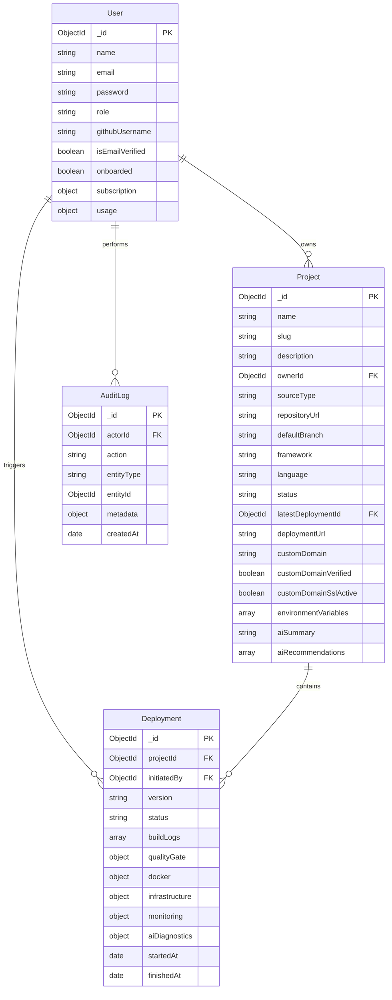
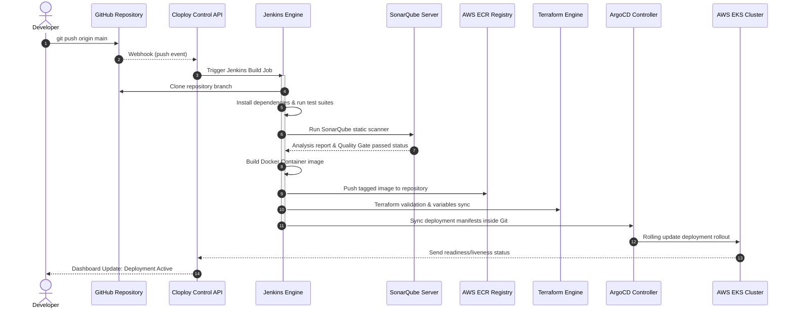

# Cloploy — Production Architecture Blueprint & Deployment Strategy

This blueprint documents the production-grade, enterprise-scale configuration of Cloploy, a multi-tenant cloud-native SaaS deployment platform.

---

## 1. Complete Folder Structure

```text
cloploy-platform/
├── cloploy/
│   ├── package.json              # Workspace root configuration
│   ├── docker-compose.yml        # Local development stack (Mongo, Redis, Sonar, Jenkins)
│   ├── apps/
│   │   ├── api/                  # Express REST Backend Orchestrator
│   │   │   ├── package.json
│   │   │   ├── src/
│   │   │   │   ├── server.js     # HTTP & Socket.IO server listener
│   │   │   │   ├── app.js        # Express middleware and routing mappings
│   │   │   │   ├── config/       # env configurations, mongoose, logging configs
│   │   │   │   ├── models/       # Mongoose Schemas (User, Project, Deployment, AuditLog)
│   │   │   │   ├── routes/       # Route handlers (auth, project, deployments, ai, billing)
│   │   │   │   ├── services/     # Engine orchestration (EKS, ECR, Jenkins, Terraform, AI)
│   │   │   │   └── scripts/      # Database seeding and migration tools
│   │   └── web/                  # Premium dark-theme React SPA Dashboard
│   │       ├── package.json
│   │       ├── index.html
│   │       ├── tailwind.config.js
│   │       ├── src/
│   │       │   ├── main.jsx
│   │       │   ├── index.css     # Premium styling with glassmorphism classes
│   │       │   ├── router.jsx    # React Router DOM mappings
│   │       │   ├── app/          # Redux toolkit store and slices configuration
│   │       │   ├── components/   # Common layout cards, charts, and shell layouts
│   │       │   └── pages/        # Dashboard, import wizard, AI diagnostics console
│   └── infra/
│       ├── kubernetes/           # Production Kubernetes base YAMLs
│       ├── helm/                 # Reusable Helm charts for tenant workloads
│       ├── argocd/               # GitOps application synchronization configs
│       ├── jenkins/              # Automated CI/CD pipelines
│       ├── terraform/            # Terraform configurations (VPC, IAM, ECR, EKS)
│       ├── logging/              # FluentBit/Loki logging aggregators
│       └── monitoring/           # Prometheus/Grafana monitoring dashboard configurations
```

---

## 2. Database ER Diagram

The following diagram illustrates the relationship between MongoDB collections inside Cloploy:



---

## 3. MongoDB Schema Design

### User Schema (`User.js`)
```javascript
const userSchema = new mongoose.Schema({
  name: { type: String, required: true },
  email: { type: String, required: true, unique: true, index: true },
  password: { type: String },
  role: { type: String, enum: ['user', 'admin'], default: 'user' },
  githubUsername: String,
  isEmailVerified: { type: Boolean, default: false },
  onboarded: { type: Boolean, default: false },
  subscription: {
    status: { type: String, enum: ['free', 'active', 'pending'], default: 'free' },
    plan: { type: String, enum: ['free', 'weekly', 'monthly'], default: 'free' },
    expiresAt: Date,
    paymentReference: String
  },
  usage: {
    monthlyBuilds: { type: Number, default: 0 },
    monthlyDeployments: { type: Number, default: 0 },
    storageGb: { type: Number, default: 0 }
  }
}, { timestamps: true });
```

### Project Schema (`Project.js`)
```javascript
const projectSchema = new mongoose.Schema({
  name: { type: String, required: true },
  slug: { type: String, required: true, unique: true, index: true },
  description: String,
  ownerId: { type: mongoose.Schema.Types.ObjectId, ref: 'User', required: true },
  sourceType: { type: String, enum: ['github', 'upload'], required: true },
  repositoryUrl: String,
  defaultBranch: { type: String, default: 'main' },
  framework: String,
  language: String,
  runtime: String,
  autoGeneratedDockerfile: String,
  status: { type: String, enum: ['draft', 'analyzed', 'building', 'deployed', 'failed'], default: 'draft' },
  latestDeploymentId: { type: mongoose.Schema.Types.ObjectId, ref: 'Deployment' },
  deploymentUrl: String,
  customDomain: String,
  customDomainVerified: { type: Boolean, default: false },
  customDomainSslActive: { type: Boolean, default: false },
  environmentVariables: [{
    key: String,
    value: String,
    masked: { type: Boolean, default: true }
  }],
  aiSummary: String,
  aiRecommendations: [String]
}, { timestamps: true });
```

### Deployment Schema (`Deployment.js`)
```javascript
const deploymentSchema = new mongoose.Schema({
  projectId: { type: mongoose.Schema.Types.ObjectId, ref: 'Project', required: true, index: true },
  initiatedBy: { type: mongoose.Schema.Types.ObjectId, ref: 'User', required: true },
  version: { type: String, required: true },
  status: {
    type: String,
    enum: ['queued', 'analyzing', 'quality_check', 'building', 'provisioning', 'deploying', 'healthy', 'rolled_back', 'failed'],
    default: 'queued'
  },
  buildLogs: [String],
  qualityGate: {
    passed: { type: Boolean, default: false },
    score: Number,
    issues: [String]
  },
  docker: { image: String, tag: String, ecrRepository: String },
  infrastructure: { cluster: String, namespace: String, ingressHost: String, terraformWorkspace: String },
  monitoring: { grafanaDashboardUrl: String, prometheusJob: String, kibanaUrl: String },
  aiDiagnostics: { summary: String, recommendations: [String], rootCause: String }
}, { timestamps: true });
```

---

## 4. Backend APIs Summary

| Method | Endpoint | Auth | Description |
|--------|----------|------|-------------|
| **POST** | `/api/auth/register` | Public | Registers a user and sends a 2FA OTP code |
| **POST** | `/api/auth/verify-otp` | Public | Verifies registration OTP and returns tokens |
| **POST** | `/api/auth/login` | Public | Authenticates credentials and issues login 2FA OTP |
| **POST** | `/api/auth/verify-login-otp` | Public | Validates OTP, issues access/refresh tokens |
| **GET** | `/api/projects` | User | Lists all projects owned by the authenticated tenant |
| **POST** | `/api/projects` | User | Creates a new draft project setup |
| **POST** | `/api/projects/import/upload/init` | User | Initializes file upload stream session |
| **POST** | `/api/projects/import/upload/complete` | User | Finishes upload, detects framework, generates specs |
| **POST** | `/api/deployments/:projectId/run` | User | Triggers the automated build and deployment engine |
| **PUT** | `/api/projects/:projectId/domain` | User | Updates and auto-resolves Route53 custom domains |
| **GET** | `/api/admin/overview` | Admin | Fetches system stats, active users, and system audit logs |

---

## 5. CI/CD Architecture Flow

Whenever code is pushed to GitHub, the webhook triggers the following pipeline:



---

## 6. Kubernetes Infrastructure Specifications

Production workloads run inside isolated namespaces with resource limits, autoscaling, and secure ingress configurations.

```yaml
# namespace.yaml
apiVersion: v1
kind: Namespace
metadata:
  name: tenant-tharaneesh
  labels:
    tier: tenant
    owner: tharaneesh
---
# ingress.yaml
apiVersion: networking.k8s.io/v1
kind: Ingress
metadata:
  name: cloploy-dashboard-ingress
  namespace: tenant-tharaneesh
  annotations:
    alb.ingress.kubernetes.io/scheme: internet-facing
    alb.ingress.kubernetes.io/target-type: ip
    alb.ingress.kubernetes.io/certificate-arn: arn:aws:acm:us-east-1:123456789012:certificate/abc-123-def
spec:
  ingressClassName: alb
  rules:
    - host: cloploy-dashboard.cloploy.app
      http:
        paths:
          - path: /
            pathType: Prefix
            backend:
              service:
                name: cloploy-dashboard
                port:
                  number: 80
```

---

## 7. Production Deployment Strategy

### Multi-Tenancy Namespace Isolation
1. **Control Plane Isolation**: The platform backend, database, logs, and ingress controllers run inside `cloploy-system` and `cloploy-monitoring` namespaces.
2. **Workload Isolation**: Every onboarded user or organization gets assigned a dedicated tenant namespace (e.g., `tenant-tharaneesh`). NetworkPolicies block cross-namespace communications, ensuring strict privacy.
3. **Resource Quotas**: CPU and Memory limits are enforced per namespace to prevent resource starvation.

### Auto Scaling
1. **Horizontal Pod Autoscaler (HPA)**: Pods scale horizontally when CPU or Memory exceed 80% capacity (configured in `hpa.yaml`).
2. **Cluster Autoscaler**: Auto-scales the underlying AWS EKS EC2 Node Groups up or down based on pending resource requests.

### Observability Architecture
- **Metrics (Prometheus & Grafana)**: Tracks CPU utilization, RAM usage, throughput, and error rates. Grafana provides dashboards for live metrics.
- **Logs (FluentBit, Loki & Kibana)**: FluentBit forwards logs from pods to Loki (for dashboard console display) and Elasticsearch (for deep debugging).

### Cost Optimization
1. **EC2 Spot Instances**: EKS worker nodes use Spot nodes for stateless microservices, reducing hosting costs by 70%.
2. **Auto-Shutdown**: Non-production environments auto-scale to 0 replicas during off-peak hours (10:00 PM - 7:00 AM) to save computing resources.
3. **Quotas**: Free tier users are limited to 3 active projects and resource allocations (256MB RAM per container).

### Disaster Recovery (DR)
- **Database backups**: Mongoose triggers hourly automated Atlas cloud backups.
- **Rollback automation**: ArgoCD provides immediate version rollbacks to preceding healthy tags if liveness checks fail.
